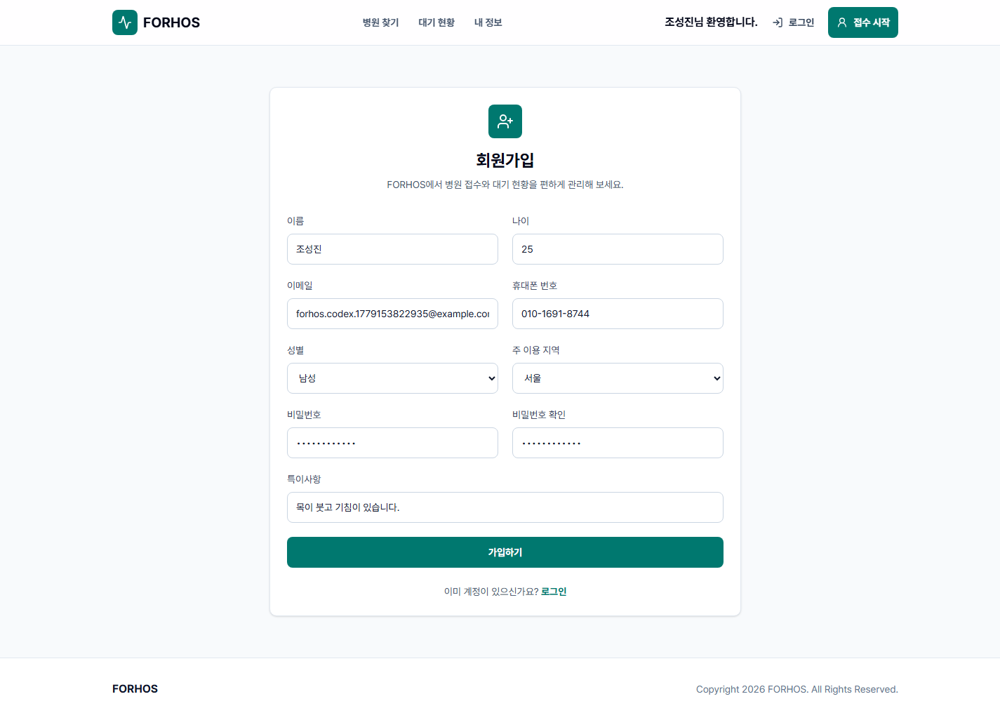
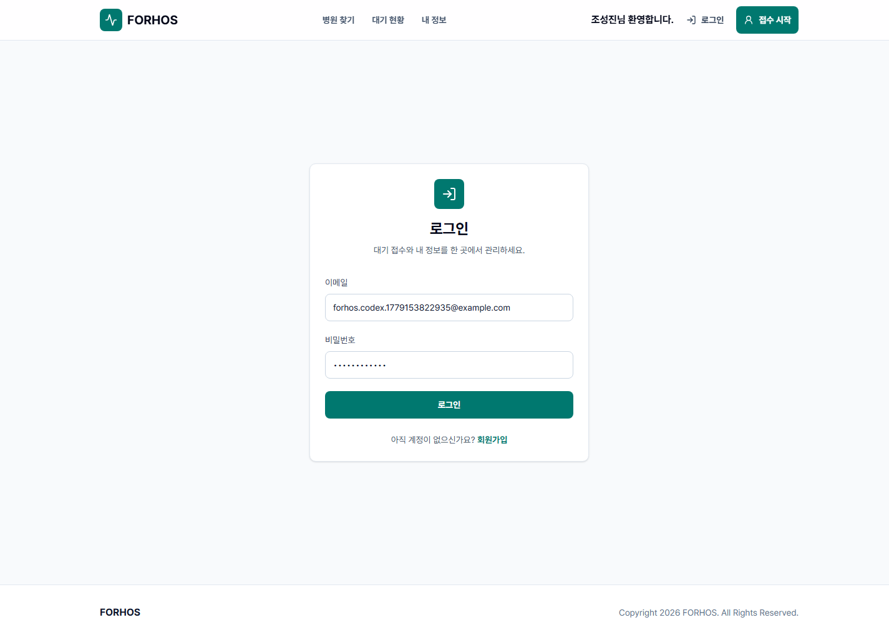
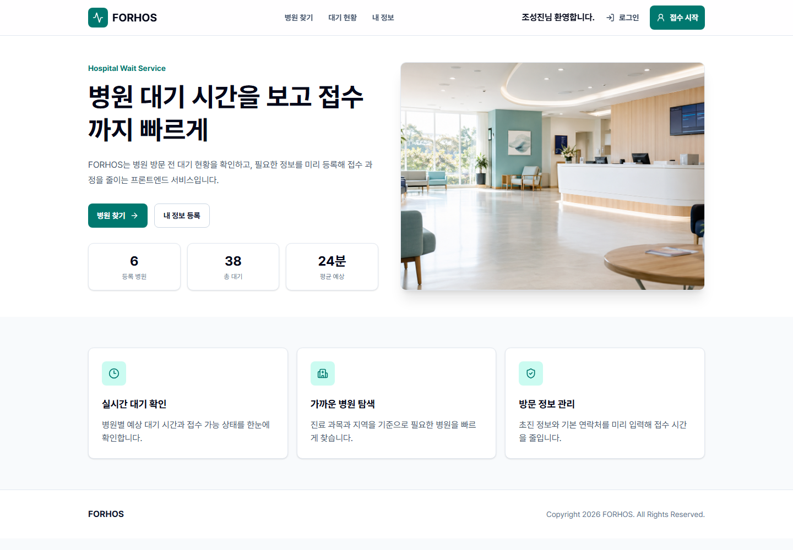
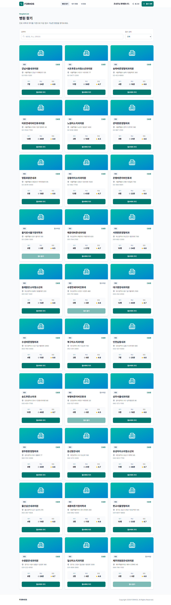
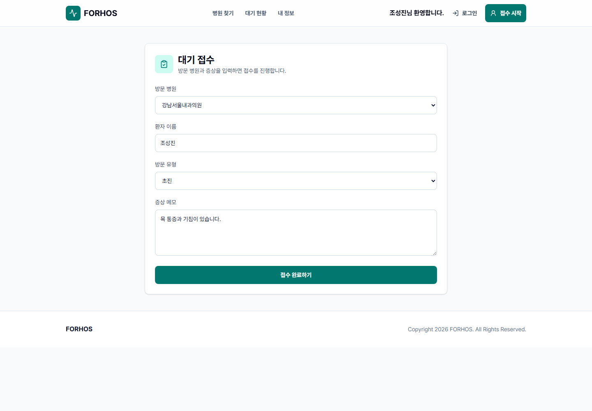
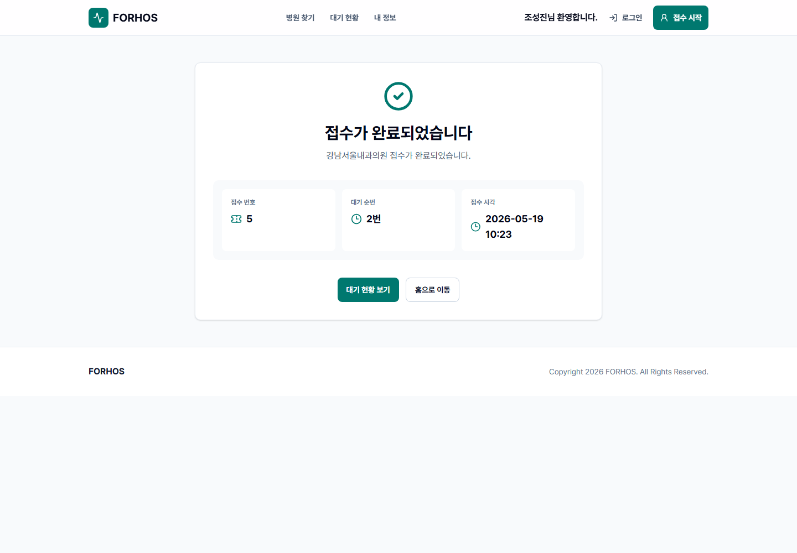
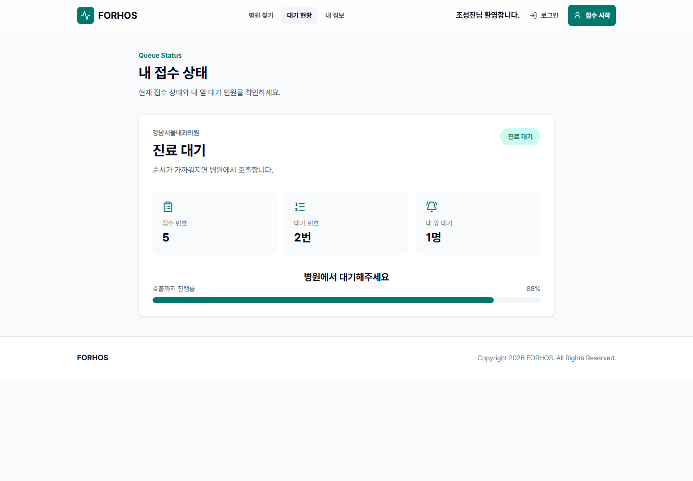

# FORHOS

> 병원 방문 전 대기 현황을 확인하고, 로그인한 사용자가 진료 접수부터 내 접수 상태 확인까지 이어서 처리할 수 있도록 만든 병원 대기 관리 프론트엔드입니다.

- Frontend Repository: https://github.com/jinkong9/FORHOS
- Backend Repository: https://github.com/jinkong9/FORHOS_Backend
- 담당 범위: 프론트엔드 화면 흐름, API 통신 계층, 인증 연동, 접수/대기열 UI, 테스트 자동화

## 프로젝트 소개

FORHOS는 병원에 도착한 뒤에야 대기 인원과 접수 흐름을 알게 되는 불편을 줄이기 위해 만든 서비스입니다. 사용자는 병원 목록을 확인하고, 로그인 후 진료 접수를 생성한 뒤, 접수 완료 화면과 대기 상태 화면에서 내 순번과 앞 대기 인원을 확인할 수 있습니다.

이 프로젝트에서 가장 중요하게 본 부분은 화면 수가 아니라 화면 사이의 데이터 흐름입니다. 접수 입력 화면에서 만든 값이 API 요청으로 전달되고, 백엔드가 계산한 대기 번호와 상태가 다시 프론트 화면으로 돌아오도록 계약을 맞췄습니다.

## 핵심 사용자 흐름

| 단계 | 사용자 행동 | 프론트엔드 | API |
| --- | --- | --- | --- |
| 1 | 회원가입/로그인 | `/signup`, `/login` | `POST /api/members/register`, `POST /api/members/login` |
| 2 | 병원 목록 확인 | `/hospital/list` | `GET /api/hospital` |
| 3 | 진료 접수 입력 | `/hospital/input` | `POST /api/reception` |
| 4 | 접수 완료 확인 | `/hospital/done` | 접수 생성 응답의 `queueNumber` 사용 |
| 5 | 내 접수 상태 조회 | `/hospital/status`, `/reception/me` | `GET /api/reception/hospital/{receptionId}/status`, `GET /api/reception/me` |

## 구현 상태

| 상태 | 기능 |
| --- | --- |
| 구현 | 회원가입, 로그인, 로그아웃 |
| 구현 | 사용자 이름 조회 및 헤더 표시 |
| 구현 | 보호 라우트와 역할 기반 병원 관리자 라우트 |
| 구현 | 병원 목록 조회, 검색, 접수 상태 필터 |
| 구현 | 진료 접수 신청, 접수 완료, 대기 상태 확인 |
| 구현 | 내 접수 목록 조회 및 접수 취소 |
| 구현 | 병원 관리자용 당일 접수 호출 |
| 구현 | API 실패/빈 상태 안내와 재시도 UI |
| 구현 | Vitest 단위 테스트와 Playwright E2E 테스트 |
| 계획 | 증상 키워드 기반 진료과 분류 |
| 계획 | No-show 방지를 위한 정책 흐름 |

## 전체 아키텍처

| 영역 | 기술 | 구현 내용 |
| --- | --- | --- |
| Frontend | React 19, TypeScript, Vite | 페이지와 라우트 기반 사용자 화면 구성 |
| Server State | TanStack Query | 병원 목록, 내 정보, 접수 생성, 내 접수 목록, 접수 상태 요청 관리 |
| HTTP Client | Axios | `/api` baseURL, Authorization 헤더, 401 토큰 만료 처리 공통화 |
| Routing | React Router DOM | 공개 라우트와 보호 라우트 분리 |
| Form | React Hook Form, Zod | 회원가입, 로그인, 진료 접수 입력 검증 |
| Styling | Tailwind CSS, shadcn/ui 스타일 컴포넌트 | 공통 Button, Card, Field 기반 UI 구성 |
| Test | Vitest, Testing Library, Playwright | 컴포넌트/라우트 테스트와 주요 사용자 흐름 E2E 검증 |

시스템 흐름:

```text
React 화면
  -> Axios apiClient
  -> Spring Boot Controller
  -> Service / Repository
  -> MySQL
  -> DTO 응답
  -> TanStack Query 캐시 갱신
```

## Frontend Architecture

```text
src
├─ app
│  ├─ providers
│  └─ router
├─ pages
├─ widgets
├─ features
├─ entities
└─ shared
```

| 폴더 | 역할 |
| --- | --- |
| `app` | 앱 전체 설정, 라우터, Provider 관리 |
| `pages` | 페이지 단위 화면 구성 |
| `widgets` | Header, Footer, 검색 영역 등 큰 UI 블록 |
| `features` | 로그인, 접수, 프로필 수정 등 기능 단위 UI |
| `entities` | 병원, 대기열 등 도메인 타입과 UI |
| `shared` | 공통 UI, 인증, API client, route 설정 |

## 구현 포인트

### API 계약 중심 화면 흐름

접수 입력 화면에서 필요한 값은 `hospitalId`, `patientName`, `visitType`, `symptom`입니다. 이 값이 `POST /api/reception` 요청으로 전달되고, 응답의 `id`, `queueNumber`, `hospitalName`, `queueStatus`를 접수 완료/대기 상태 화면에서 이어서 사용합니다.

### 공통 인증 처리

각 화면마다 토큰을 직접 다루지 않도록 `shared/api/apiClient.ts`에 access token 저장, Authorization 헤더 주입, 토큰 만료 응답 처리, refresh token 재요청 흐름을 모았습니다.

### 보호 라우트

내 정보, 병원 등록, 접수 입력, 접수 완료, 접수 상태, 내 접수 목록은 `ProtectedRoute`로 감쌌습니다. 병원 관리자 접수 관리 화면은 `HOSPITAL_ADMIN`, `ADMIN` 역할만 접근할 수 있게 분리했습니다.

### 대기 상태 UI

접수 상태는 `WAITING`, `CALLED`, `COMPLETED`, `CANCELED`로 제한하고, 상태별 문구와 진행률을 화면에서 다르게 보여주도록 구성했습니다.

## API 연결 요약

| Method | Endpoint | 용도 |
| --- | --- | --- |
| POST | `/members/register` | 회원가입 |
| POST | `/members/login` | 로그인 |
| POST | `/members/logout` | 로그아웃 |
| GET | `/members/myinfo` | 사용자 이름 및 내 정보 조회 |
| PATCH | `/members/myinfo` | 내 정보 수정 |
| GET | `/hospital` | 병원 목록 조회 |
| POST | `/reception` | 진료 접수 생성 |
| GET | `/reception/me` | 내 접수 목록 조회 |
| GET | `/reception/me/latest` | 최신 접수 상태 조회 |
| PATCH | `/reception/{id}/cancel` | 접수 취소 |
| GET | `/reception/hospital/{id}/today` | 병원별 당일 접수 조회 |
| GET | `/reception/hospital/{receptionId}/status` | 접수 상태 조회 |
| PATCH | `/reception/{id}/call` | 병원 관리자 접수 호출 |
| PATCH | `/reception/{id}/complete` | 병원 관리자 진료 완료 |

## 결과 사진















## E2E 테스트

Playwright로 백엔드 API를 네트워크 레벨에서 mock 처리해 프론트 사용자 흐름을 검증합니다.

검증하는 흐름:

- 홈 화면 렌더링
- 병원 목록 API 데이터 표시
- 보호 라우트의 로그인 리다이렉트
- 회원가입 성공 후 로그인 화면 이동
- 로그인 사용자의 진료 접수 생성, 접수 완료, 대기 상태 확인
- 내 접수 내역에서 접수 취소
- 병원 관리자 권한으로 대기 접수 호출

```bash
npm run e2e
```

## 로컬 실행

```bash
npm install
npm run dev
```

프론트엔드는 Vite 개발 서버에서 실행됩니다. API 요청은 `/api` 경로를 사용하며, 개발 환경에서는 Vite proxy를 통해 `http://localhost:8080` 백엔드 서버로 전달됩니다.

## 검증 명령

```bash
npm test
npm run lint
npm run build
npm run e2e
```

## AI 활용 및 MCP 기반 개발 방식

이번 프로젝트에서는 AI를 단순 코드 생성 도구가 아니라, 기획을 구조화하고 구현 품질을 끌어올리는 개발 파트너로 활용했습니다. 요구사항을 먼저 정리한 뒤 Codex와 함께 로컬 프로젝트를 분석하고, 구현 흐름을 검토하며, 화면 캡처와 테스트 자동화를 반복해 프로젝트 완성도를 높였습니다.

| 도구 | 활용 내용 | 효과 |
| --- | --- | --- |
| Notion MCP | 프로젝트 보고 내용과 포트폴리오 문서 정리 | 기능 설명, 기술 선택 이유, 결과 이미지 흐름을 문서화 |
| GitHub MCP | 저장소 구조와 구현 상태 확인 | 실제 코드 기준으로 라우트, API, 테스트 범위를 검증 |
| Terminal | 테스트, 빌드, 파일 구조 확인 | AI 제안 내용이 실제 프로젝트에서 동작하는지 확인 |
| Playwright | 주요 화면과 사용자 흐름 검증 | 회원가입, 로그인, 병원 목록, 접수, 상태 확인을 자동화 |

## 회고

FORHOS를 만들면서 가장 많이 다룬 부분은 프론트엔드와 백엔드 사이의 연결이었습니다. 병원 선택, 접수 생성, 대기 상태 조회는 각각 다른 화면처럼 보이지만 실제로는 하나의 데이터 흐름입니다. 사용자가 입력한 값이 API 요청으로 들어가고, 백엔드가 계산한 대기 번호와 앞 대기 인원이 다시 화면으로 돌아와야 서비스가 완성됩니다.

또한 인증이 들어가면서 공통 통신 계층의 필요성을 확인했습니다. access token을 매 요청마다 붙이고, 만료 시 재발급을 시도하는 로직은 개별 화면보다 Axios client에 두는 편이 유지보수에 적합했습니다.
