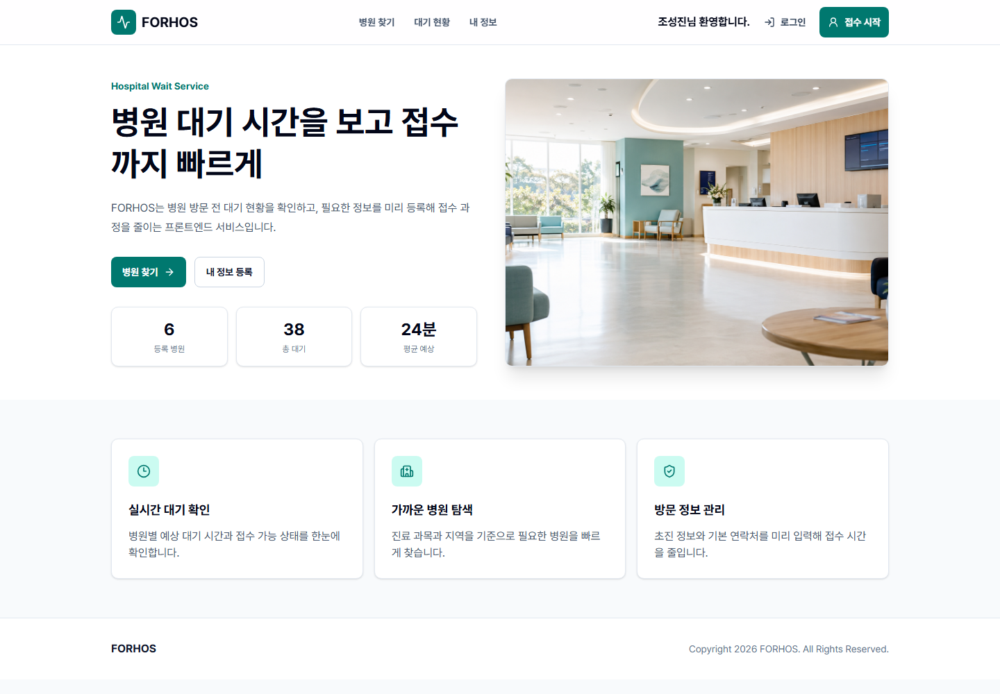
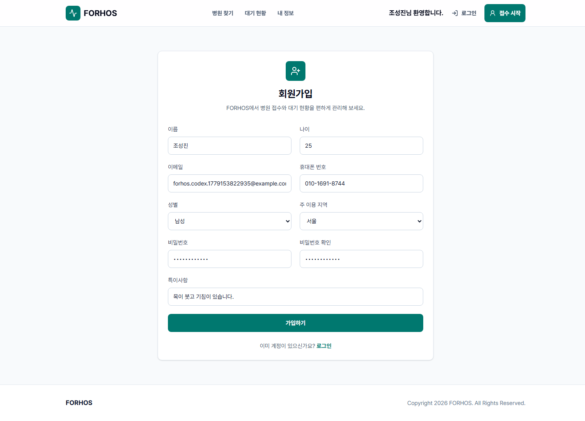
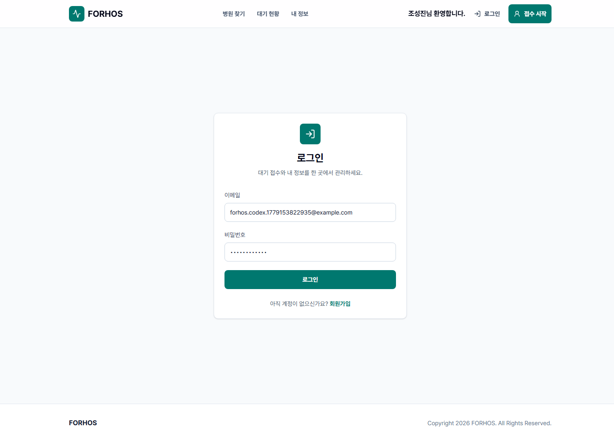
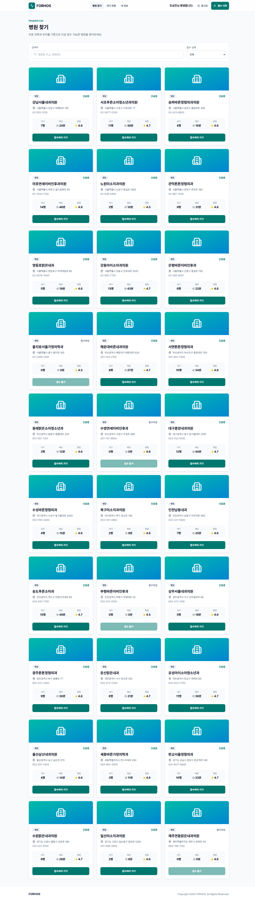
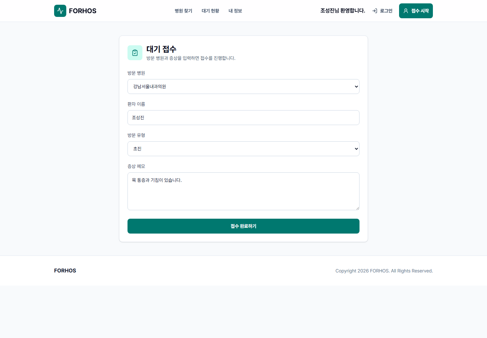
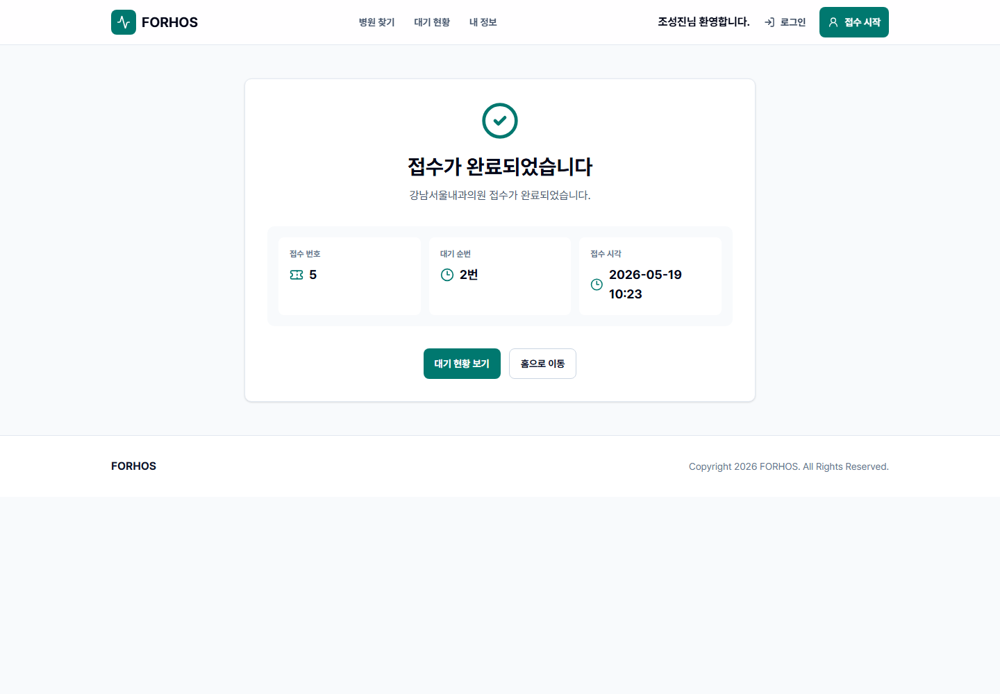
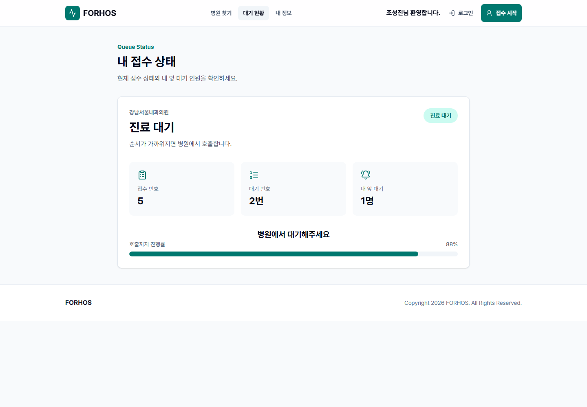

<div align="center">
  <h1>FORHOS</h1>
  <p><strong>병원에 가기 전, 접수부터 내 대기 순서까지.</strong></p>
  <p>병원 검색, 진료 접수, 대기 현황 확인을 하나의 흐름으로 연결하는 병원 대기 관리 서비스입니다.</p>

  <p>
    <a href="https://github.com/jinkong9/FORHOS"></a>
    <a href="https://github.com/jinkong9/FORHOS_Backend"></a>
    
    
    
  </p>

  
</div>

## Overview

FORHOS는 사용자가 병원에 도착하기 전에 병원 정보를 살펴보고, 진료 접수를 마친 뒤 자신의 대기 상태를 확인할 수 있도록 돕습니다. 프론트엔드는 회원 인증부터 접수 생성, 접수 내역과 상태 조회까지 이어지는 사용자 흐름을 제공합니다.

### 주요 기능

| 영역 | 기능 |
| --- | --- |
| 계정 | 회원가입, 로그인, 로그아웃, 내 정보 및 의료 프로필 관리 |
| 병원 | 병원 목록·상세 조회, 검색 및 접수 현황 확인 |
| 접수 | 진료 접수, 접수 완료 확인, 내 접수 조회 및 취소 |
| 대기 | 내 최신 접수와 대기 상태 확인 |
| 관리자 | 당일 접수 조회, 접수 호출 및 완료 |
| 추천 | 증상 키워드 기반 진료과 추천 |

### 화면 미리보기

<details>
  <summary>주요 화면 펼쳐보기</summary>
  <br>
  <table>
    <tr>
      <td><br><sub>회원가입</sub></td>
      <td><br><sub>로그인</sub></td>
    </tr>
    <tr>
      <td><br><sub>병원 검색</sub></td>
      <td><br><sub>진료 접수</sub></td>
    </tr>
    <tr>
      <td><br><sub>접수 완료</sub></td>
      <td><br><sub>대기 현황</sub></td>
    </tr>
  </table>
</details>

## User Flow


```mermaid
flowchart LR
    A[병원 검색] --> B[병원 상세 확인]
    B --> C[로그인 또는 회원가입]
    C --> D[진료 접수]
    D --> E[접수 완료 및 대기 번호]
    E --> F[내 대기 상태 확인]
```

## Tech Stack

| 분류 | 기술 |
| --- | --- |
| UI | React 19, TypeScript |
| 개발 서버 / 번들러 | Vite |
| 라우팅 | React Router DOM |
| 서버 상태 | TanStack Query |
| API 통신 | Axios |
| 폼 / 검증 | React Hook Form, Zod |
| 스타일 / 컴포넌트 | Tailwind CSS, Radix UI |
| 테스트 | Vitest, Testing Library, Playwright |

## Getting Started

### 준비물

- Node.js와 npm
- Docker Desktop
- 프론트엔드와 백엔드 저장소를 나란히 둘 작업 폴더

### 설치 및 실행

두 저장소를 같은 상위 폴더에 clone합니다. Docker Compose가 `../FORHOS_Backend`에서 백엔드를 빌드하므로 폴더 이름과 배치는 아래처럼 유지해야 합니다.

```bash
mkdir forhos-local
cd forhos-local
git clone https://github.com/jinkong9/FORHOS.git
git clone https://github.com/jinkong9/FORHOS_Backend.git
```

백엔드와 MySQL, Redis, RabbitMQ를 실행합니다.

```bash
cd FORHOS
docker compose up -d --build
```

프론트엔드 의존성을 설치하고 개발 서버를 시작합니다.

```bash
npm ci
npm run dev
```

브라우저에서 <http://localhost:5173>을 엽니다. Vite는 `/api` 요청을 로컬 백엔드 `http://localhost:8080`으로 전달합니다.

### 로컬 주소

| 서비스 | 주소 |
| --- | --- |
| 프론트엔드 | <http://localhost:5173> |
| 백엔드 API 문서 | <http://localhost:8080/swagger-ui/index.html> |
| RabbitMQ 관리 화면 | <http://localhost:15672> |

로컬 RabbitMQ 관리 계정은 `forhos` / `forhos`입니다. 개발용 계정과 설정은 로컬 실행 전용입니다.

### 종료

Vite 개발 서버는 `Ctrl+C`로 종료하고, `FORHOS` 폴더에서 컨테이너를 종료합니다.

```bash
docker compose down
```

DB 데이터를 지우고 초기화하려는 경우에만 `docker compose down -v`를 사용하세요. 이 명령은 MySQL, Redis, RabbitMQ 저장 데이터도 삭제합니다.

## Scripts

| 명령어 | 설명 |
| --- | --- |
| `npm run dev` | Vite 개발 서버 실행 |
| `npm run build` | TypeScript 검사 및 프로덕션 빌드 |
| `npm test` | Vitest 단위·컴포넌트 테스트 |
| `npm run lint` | ESLint 검사 |
| `npm run e2e` | Playwright 사용자 흐름 테스트 |

## Project Structure

```text
src/
├── app/        # 앱 설정, Provider, 라우터
├── pages/      # 라우트별 화면
├── widgets/    # 헤더, 검색 영역 등 화면 블록
├── features/   # 인증, 접수, 프로필 등 사용자 기능
├── entities/   # 병원 등 도메인 모델과 UI
└── shared/     # 공통 API, 인증, UI, 유틸리티
```

## Related Repositories

- [FORHOS Backend](https://github.com/jinkong9/FORHOS_Backend)
- [전체 로컬 실행 가이드](docs/local-development.md)
